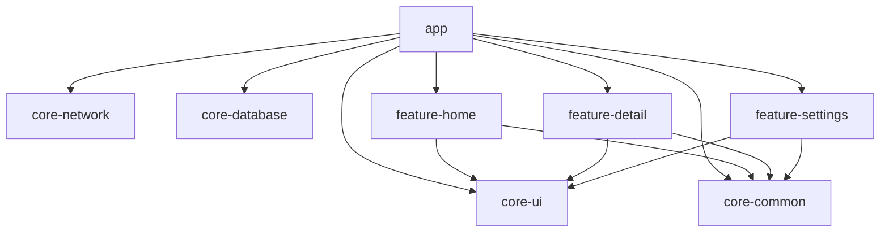

# Android Modularization Blueprint

Problem: incremental builds slow down as a single-module Android app grows, because touching
one file forces Gradle to recompile and re-link everything that shares its module.

## Architecture

```
android-modularization-blueprint/
├── app/                     # thin app module: NavHost + DI wiring only
├── core/
│   ├── core-ui/             # shared Compose theme, reusable components
│   ├── core-network/        # Retrofit/OkHttp client setup (unused by the fake repo, but present)
│   ├── core-database/       # Room setup (unused by the fake repo, but present)
│   └── core-common/         # domain models, repository interfaces, fake data, Result-style wrapper
├── feature/
│   ├── feature-home/        # list screen + ViewModel
│   ├── feature-detail/      # detail screen + ViewModel
│   └── feature-settings/    # theme toggle screen
├── build.gradle.kts
├── settings.gradle.kts
└── gradle/libs.versions.toml
```



`feature-*` modules depend only on `core-*` modules, never on each other or on `app`.
`app` depends on every module, but only to build the NavHost and let Hilt assemble the
dependency graph - it contains no screens or business logic of its own.

### `api` vs `implementation`

- **`core-ui`** exposes Compose (`compose-bom`, `ui`, `material3`, `foundation`) as `api`.
  It's the design-system module: every screen is built with these types, so re-exporting
  them guarantees one consistent Compose version everywhere instead of every feature
  module pinning its own.
- **`core-common`** exposes `kotlinx-coroutines-core` as `api` because its repository
  interfaces return `StateFlow<T>` directly - any consumer needs `Flow` on its own
  compile classpath to even read the type.
- **`core-network`** exposes Retrofit/OkHttp as `api` for the same reason: its factory
  function returns a `Retrofit` instance.
- **`core-database`** exposes Room as `api`: `AppDatabase` and its DAOs are Room types
  returned from public functions.
- **Every `feature-*` module** depends on `core-common` and `core-ui` with
  `implementation`. Only `app` ever depends on a feature module, and `app` already pulls
  in `core-ui`/`core-common` directly - so there's no reason to leak those types further
  downstream through `api`.

Getting this wrong (defaulting everything to `api`) is what quietly turns a modularized
app back into a monolith at build-graph level: every module ends up needing to recompile
whenever any dependency changes, because the compile classpath of every consumer grew to
include everything transitively.

## Demo

Home (list) → tap an item → Detail screen, with a Settings screen reachable from Home's
top bar that toggles Light / Dark / System theme.

[GIF placeholder]

## Dependency injection

- Repositories (`ItemRepository`, `ThemeRepository`) are backed by hardcoded in-memory
  implementations, bound once via `@Binds` in `core-common`'s `CommonModule`, installed
  in Hilt's `SingletonComponent`. Both `feature-home`/`feature-detail` and
  `feature-settings` inject the *same* singleton, so toggling the theme in Settings is
  immediately visible in `app`'s top-level `MaterialTheme`.
- Every screen's ViewModel is a `@HiltViewModel` with `@Inject`-annotated constructor -
  Hilt generates the module that provides it, scoped per-feature, so no feature module
  needs to hand-write a `@Provides` method just to expose a ViewModel.
- `core-network` and `core-database` register their own Hilt modules but are never
  wired into a real screen - they exist to show where a production data source would
  slot into the graph without touching feature or `core-common` code.

## Metric

Incremental build time after touching one file in `feature-home` and running
`./gradlew assembleDebug`:

- Monolith (`monolith-baseline` branch): [MEASURE AFTER BUILD] s
- Modularized (`main` branch): [MEASURE AFTER BUILD] s ([MEASURE AFTER BUILD]% faster)

Reproduce it yourself:

```bash
# Modularized
git checkout main
echo "// touch" >> feature/feature-home/src/main/kotlin/com/ranab4b/modularization/feature/home/HomeScreen.kt
time ./gradlew assembleDebug

# Monolith baseline
git checkout monolith-baseline
echo "// touch" >> app/src/main/kotlin/com/ranab4b/modularization/feature/home/HomeScreen.kt
time ./gradlew assembleDebug
```

## Stack

Kotlin, Jetpack Compose, Hilt, Compose Navigation, Gradle version catalogs

## Run it

```bash
./gradlew assembleDebug
```

Or open the project in Android Studio and run the `app` configuration on an
emulator/device (minSdk 26).
